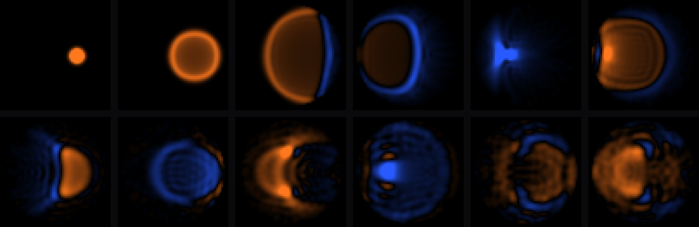
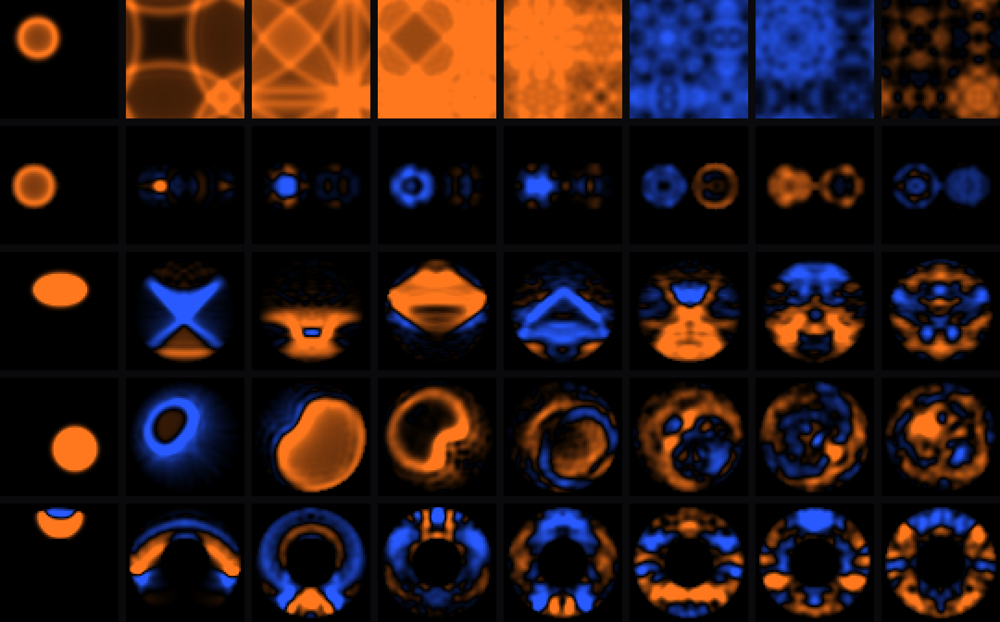
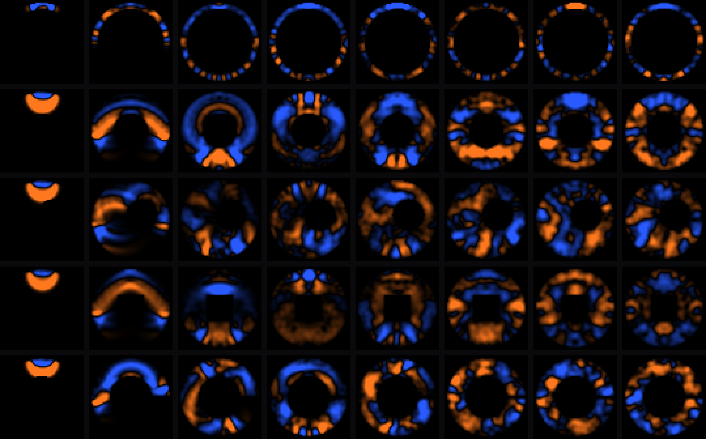
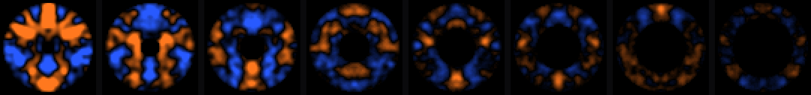

# 2D membrane mesh — reference model

> **Historical.** This records the exploration, not the instruments that came
> out of it. The membrane now lives in
> [`gateware/src/top/lacuna/mesh.py`](../../gateware/src/top/lacuna/mesh.py) and
> is played by [LACUNA](../../gateware/src/top/lacuna/LACUNA.md) and
> [ORBITA](../../gateware/src/top/orbita/ORBITA.md). Build and install
> instructions below are superseded.


Numpy model of the 2D FDTD membrane, in the exact fixed-point arithmetic the
Amaranth core will use. Two jobs: decide whether this is musically worth
building before any gateware exists, and fix the widths, shifts and rounding so
the gateware has a reference to be tested against.

Nothing here runs on hardware. That is the point — every question below was
settled without a bitstream.

## What it does

The update is the leapfrog scheme at the Courant limit:

```
u_next = ((u[N] + u[S] + u[E] + u[W]) >> 1) - u_prev
```

Three adds, a shift, a subtract. **No multiplies**, which is why this fits the
ECP5 with all 28 DSP tiles left over.



*Strike at 0.1 ms through 10 ms: the ring expands, reflects off the rim,
collapses back through itself and sets up interference. Orange is positive
displacement, blue negative, one shared scale across all twelve frames.*

## Result: the modes are right

Measured against an ideal circular membrane (ratios computed from Bessel zeros,
not a hand-typed table):

| mode | measured | ratio | ideal | error |
|------|----------|-------|-------|-------|
| 01 | 427.7 Hz | 1.000 | 1.000 | +0.0% |
| 11 | 681.4 Hz | 1.593 | 1.593 | −0.0% |
| 02 | 981.5 Hz | 2.295 | 2.295 | −0.0% |
| 12 | 1247.1 Hz | 2.916 | 2.917 | −0.1% |
| 22 | 1496.8 Hz | 3.499 | 3.500 | −0.0% |
| 23 | 2065.5 Hz | 4.829 | 4.832 | −0.1% |
| 04 | 2093.5 Hz | 4.894 | 4.903 | −0.2% |
| 43 | 2545.2 Hz | 5.950 | 5.977 | −0.4% |
| 44 | 3115.7 Hz | 7.284 | 7.325 | −0.6% |
| 36 | 4028.3 Hz | 9.418 | 9.391 | +0.3% |

Worst case 0.6%, a tenth of a semitone, out to 9.4× the fundamental. The
direction-dependent dispersion a rectilinear mesh is known for is real but does
not bite at this radius and in this frequency range. The fundamental also lands
at 427.7 Hz against an analytic prediction of 433 Hz for R=30 at the Courant
limit, which is the geometry checking out independently.

## What the model has already caught

Four things, none of which would have been obvious from the equations:

1. **18-bit state is not enough.** The loss term is `u -= u >> loss_shift`, which
   does nothing at all once `|u| < 2**loss_shift`. At 17 fractional bits with
   `loss_shift=13` that dead zone sits at −24 dBFS: the tail freezes and parks
   at a DC offset. Fixed by going to 24-bit state (22 fractional bits), which
   costs 197 kbit of the ECP5's 1008 kbit for a 64×64 mesh. Still no multipliers.
2. **Forcing a minimum decrement cures the dead zone but ruins the tail.** It
   imposes a linear decay that eats exactly the quiet ringing that makes a
   struck membrane sound alive. Rejected in favour of the wider state.
3. **The frequency-dependent loss term was wrong.** Pulling each node toward the
   average of its neighbours does not damp highs preferentially: `nxt` is
   u[n+1] while the neighbour average is u[n], so the difference is dominated by
   the temporal term and it damps broadband — 66 dB in half a second, measured.
   Proper HF loss needs the Laplacian of the *velocity*, which means a neighbour
   sum of `u_prev` as well as `u` and so doubles memory traffic per node.
   Currently disabled (`air_shift >= 32`); see below.
4. **A Nyquist-frequency limit cycle** sits in the truncation, at roughly
   −85 dBFS. Inaudible in practice but it never dies. Wider state pushes it down;
   a DC/Nyquist blocker on the output tap would remove it outright.
5. **A default repeated in two places silenced every demo.** `render()` carried
   its own copies of `loss_shift` and `air_shift`, so fixing them on `Membrane`
   did nothing and every rendered file was a 10 ms click followed by silence --
   with the broken broadband damping of (3) still active. `render()` now defaults
   them to `None` and defers.

## The interesting version

Realism was never the point. Every variant below costs the same per-node
arithmetic -- adds and shifts, no multipliers -- but none of them can exist as a
physical object.



*Rows top to bottom: torus, twin lobes, stretched, self-oscillating, annulus.
Columns at 0.3, 1.5, 3, 5, 8, 14, 22 and 35 ms after the strike.*

| variant | what it is | why it is not a drum |
|---|---|---|
| `torus` | edges wrap instead of reflecting | no rim, so nothing returns in phase; the modes are not Bessel and it never settles to a pitch |
| `twin_lobes` | two discs joined by a narrow neck | energy sloshes between the lobes, beating at a rate set by the neck width |
| `stretched` | 3:1 anisotropic tension | a real membrane under this tension tears; this one just detunes |
| `self_oscillating` | a region that amplifies rather than damps | pumps until clipping saturates it, and never decays: a surface that plays itself |
| `annulus` | a hole in the middle | the hole is a second boundary, giving a Bessel series crossed with a cavity |

```bash
python weird.py          # renders w1..w5 wavs
python weird_frames.py   # renders the grid above
```

The boundary is just a boolean array, so any bitmap is a valid instrument. That
is the part with no analogue on a sampler or a modal synth.

## The annulus, explored

The annulus turned out to be the most interesting of the five, so `annulus.py`
maps its space. The mask is two radius comparisons, which on hardware is two
registers -- so every variant here is a CV input, not a rebuild.



*Rows: thin ring, wide ring, offset hole, square hole, slit ring. Columns at
0.3 to 35 ms.*

| variant | f0 | partials |
|---|---|---|
| thin ring | 2962 Hz | 1.00 1.08 1.13 1.20 1.91 |
| wide ring | 953 Hz | 1.00 1.14 1.46 1.86 2.08 |
| narrow hole | 664 Hz | 1.00 1.39 2.03 2.65 3.29 |
| offset hole | 952 Hz | 1.00 1.13 1.25 1.99 2.27 |
| square hole | 873 Hz | 1.00 1.14 1.57 1.98 2.80 |
| slit ring | 1175 Hz | 1.00 1.15 1.41 1.71 1.97 |

Note how far these are from the circular membrane's 1.00 1.59 2.14 2.30: the
hole is a second boundary, and the partial structure it produces has no simple
description. A thin ring is a bar bent into a circle and pitches an octave and
a half above a wide one.

`a7_hole_opening.wav` is the one with no physical counterpart: the hole opens
from radius 4 to 20 *while the surface is ringing*, so the instrument morphs
continuously rather than being retuned between hits.



**Watch the pickup point.** A pickup or strike coordinate that falls inside the
hole reads zero forever, which looks exactly like a dead model -- it silenced
the thin ring completely and killed the last quarter of the morph before
`check_on_material()` was added to catch it.

## Playing to what the hardware is actually for

The physical model does not need an FPGA. A 32x32 mesh fits on an H7, using
about 82% of it. What follows does not fit anywhere else in the rack.

**The boundary as an audio-rate parameter.** On a CPU the mask is a 4096-element
array you rebuild when the shape changes, so shape is a control-rate parameter
at best. In gateware it is a comparator inline in address generation -- two
radius registers -- so changing it *every sample* is free. The shape of the
instrument becomes a modulation destination. No acoustic object has geometry
that oscillates at 200 Hz.

It works, and it produces real sidebands: at 220 Hz modulation, peaks at 692 and
912 Hz, 2173 and 2388 Hz. But a moving boundary is a genuinely hard problem in
FDTD and the three obvious approaches each fail differently:

| approach | tonal share | rms | verdict |
|---|---|---|---|
| static annulus (reference) | 0.675 | — | — |
| hard mask | 0.287 | 0.042 | stable, but nodes snapping in and out inject broadband noise |
| per-sample rim taper | 0.071 | 0.004 | wrong: multiplying by 3/4 each sample is a decay of 0.75^48000 |
| newly-born nodes take neighbour average | 0.243 | 0.058 at 60 Hz | stable low, but **pumps energy and saturates at 220 Hz** |

So the usable territory today is the hard mask, whose noise is arguably part of
the character, or born-from-neighbours below about 100 Hz. An energy-conserving
moving boundary is the open research problem here, not a coding task.

`u1`-`u6` are the renders that work: geometry under a 3 Hz LFO, then 60, 220 and
700 Hz; a drone where geometry oscillates while a region pumps energy in; and
the same modulation applied to a resonator driven by external audio rather than
struck.

**The other two USPs.** The first is built: the surface state is already in the
memory the audio is read from, so drawing it costs about 620 LUTs and one BRAM,
with no framebuffer, no PSRAM and no CPU. Both instruments do it. The second --
injecting the module's own output back into the mesh with single-sample latency,
making the surface part of a patch's feedback loop rather than an endpoint -- is
still not built.

## Status and what is still open

- Frequency-dependent damping is **not implemented**, and an attempt at it was
  measured and abandoned: adding a fraction of the Laplacian back each update
  moved spatial coherence from 62% to 64% and made ORBITA's output waveform
  rougher, not smoother. The real cause of the roughness it was meant to fix
  turned out to be the excitation -- a single-cell strike is a spatial
  white-noise generator -- so `mesh.py` gained a mallet radius instead.
- No shell, no air cavity, no nonlinear tension modulation. Those are what
  separate "struck membrane" from "recognisable drum"; see the note in the
  session discussion.
- The peak-finding in `analyse_modes.py` needs a strike and pickup that excite
  the modes you want to see. It reports the modes it finds, not all of them.

## Files

| | |
|---|---|
| `mesh_model.py` | the fixed-point model |
| `analyse_modes.py` | modal ratios vs ideal circular membrane |
| `render_finals.py` | the five demo WAVs |
| `render_propagation.py` | the propagation frames above |
| `render_demos.py` | earlier scratch harness, kept for the measurement notes |

```bash
pip install numpy scipy pillow
python analyse_modes.py
python render_finals.py
```
