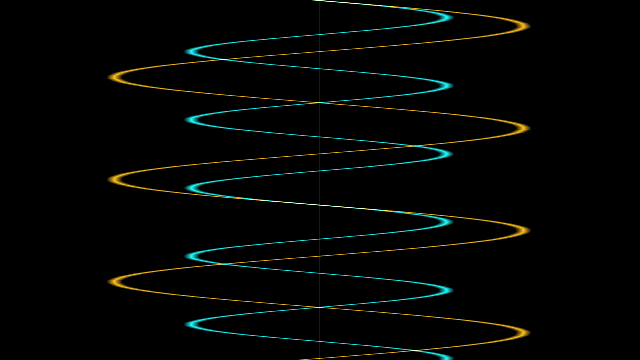
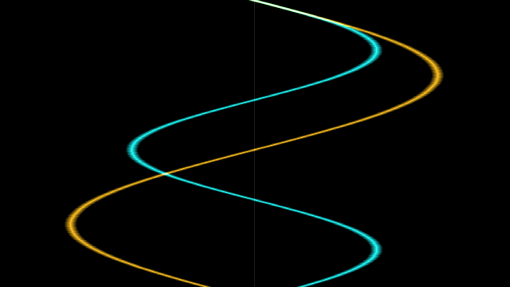
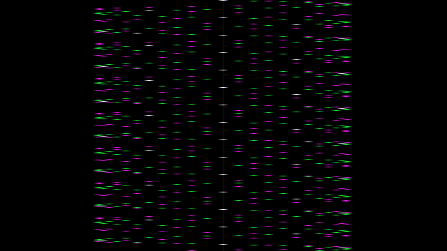

# Wavefield — a beamracing core for Tiliqua

A pattern core for Tiliqua's `beamrace` top-level. There is no framebuffer, no
PSRAM, no CPU and no memory of any kind: the colour of every pixel is computed
from the live audio inputs a few microseconds before that pixel is transmitted
down the GPDI cable.

This is the shortest path to something a Daisy or a Teensy cannot do at all.
Not "does more slowly" — an H7 has no video output, and no way to put audio and
pixels in the same clock domain.



## The idea

At 720p60 the line rate is 45 kHz and the codec runs at 48 kHz, so **one
scanline carries very nearly one audio sample**. Each line samples-and-holds the
inputs at hsync and draws its whole trace from that one sample.

Time therefore runs *down* the screen at 45 kHz. A frame is 720 consecutive
samples — a 16 ms window — and pitch becomes visible geometry: an input at an
exact multiple of 60 Hz stands perfectly still, detune it slightly and the whole
field creeps, exactly like an analogue scope with a free-running timebase.

Low frequencies read as waveforms:



Push past a few hundred Hz and consecutive scanlines stop connecting, and the
picture becomes a moiré interference field instead. That is not a bug to fix —
it is the most interesting region to patch into:



## Jacks

| Jack | Function |
|------|----------|
| in0  | trace A (audio) |
| in1  | trace B (audio) |
| in2  | zoom CV, ~1 V per step, 0–7 V |
| in3  | palette CV, ~2 V per palette |
| out0–3 | inputs copied through |
| GPDI | video (fixed modeline) |

## Install into the Tiliqua tree

```bash
cp wavefield.py /path/to/tiliqua/gateware/src/top/beamrace/
```

Then two edits to `gateware/src/top/beamrace/top.py`:

```python
from wavefield import Wavefield          # near the other imports

CORES = {
    "stripes":   Stripes,
    "balls":     Balls,
    "checkers":  Checkers,
    "wavefield": Wavefield,               # add this
}
```

Build and flash:

```bash
cd gateware
pdm beamrace build --core=wavefield --modeline <your modeline>
pdm flash ...
```

`wavefield.py` deliberately does not import from `top.py` — `top.py` imports it,
and importing back would be circular. It carries its own copy of the
`BeamRaceInputs` / `BeamRaceOutputs` signatures instead. `BeamRaceTop` drives
those members directly rather than through `wiring.connect`, so a structurally
identical pair is all it needs. If upstream changes those signatures, update the
copies at the top of `wavefield.py`.

## The fast loop

Do not iterate by building bitstreams. `preview.py` renders frames using only
the Amaranth simulator — no Tiliqua tree, no yosys, no nextpnr, no hardware:

```bash
pip install amaranth pillow
python preview.py --freq-a 220 --freq-b 330 --out frame.png
```

About 30 s per frame against minutes for a bitstream. Get the picture right
here, then build once. The preview runs at half of 720p (640x360 active) but
still advances the sample-and-hold once per scanline, which is the relationship
the whole effect depends on; test frequencies are scaled by 2 so the preview
shows the same number of cycles the real screen would.

Useful starting points:

```bash
python preview.py --freq-a 60  --freq-b 90            # locked, standing waves
python preview.py --freq-a 900 --freq-b 1350 --palette 4   # moire field
python preview.py --freq-a 220 --freq-b 221           # near-unison, watch it creep
```

## Notes

- Two pipeline stages put the picture one pixel later than the PHY's own sync
  delay. Not worth a stage to correct.
- `zoom` shift 7 puts a full-scale (±8.192 V) input at ±256 px. Each volt on in2
  halves the deflection from there. Negative CV wraps rather than clamping.
- Everything is shifts, adds and comparisons — no multipliers, so this leaves
  the ECP5's DSP tiles free for whatever you add next.

## Where this goes next

The core currently maps one sample to one horizontal position. The same
skeleton supports:

- **Two-axis deflection** — use in1 as a vertical offset per line for a sheared,
  3D-looking field rather than a flat trace.
- **A second time-base** — divide the line counter so the screen shows several
  interleaved windows of the same signal at different zooms.
- **Per-pixel synthesis** — the beam position is itself a fast ramp. Feed x and
  y into an oscillator and the screen becomes a wavetable you can see.

For anything needing memory (persistence, feedback, sample playback), move to
the `vectorscope_no_soc` skeleton, which adds PSRAM, a framebuffer, phosphor
decay and the `Stroke` core that turns any per-sample stream into plotted points.
